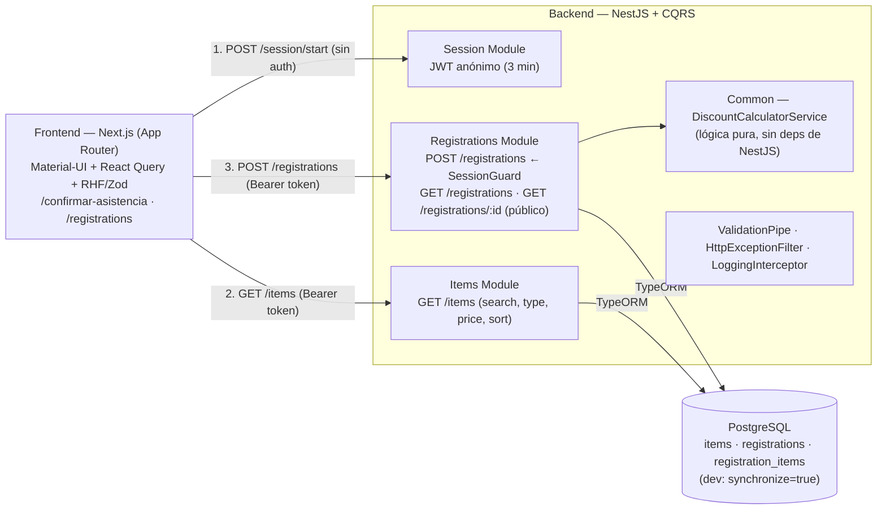
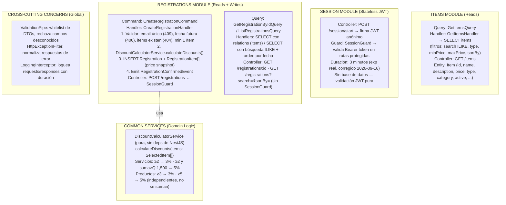
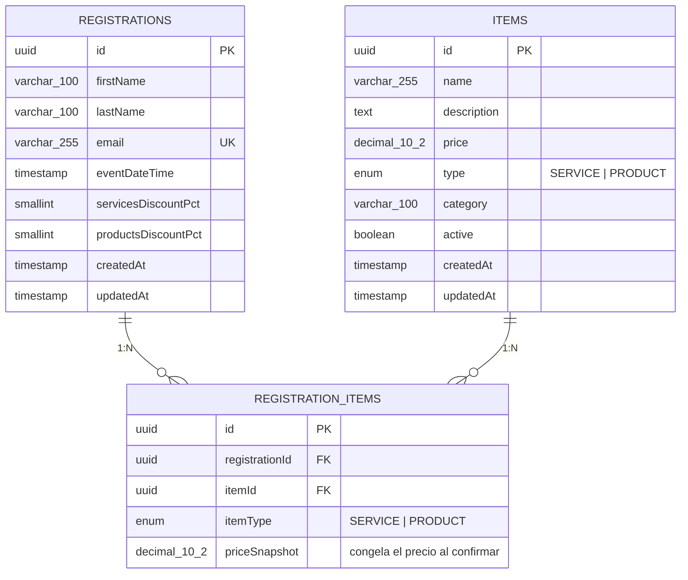
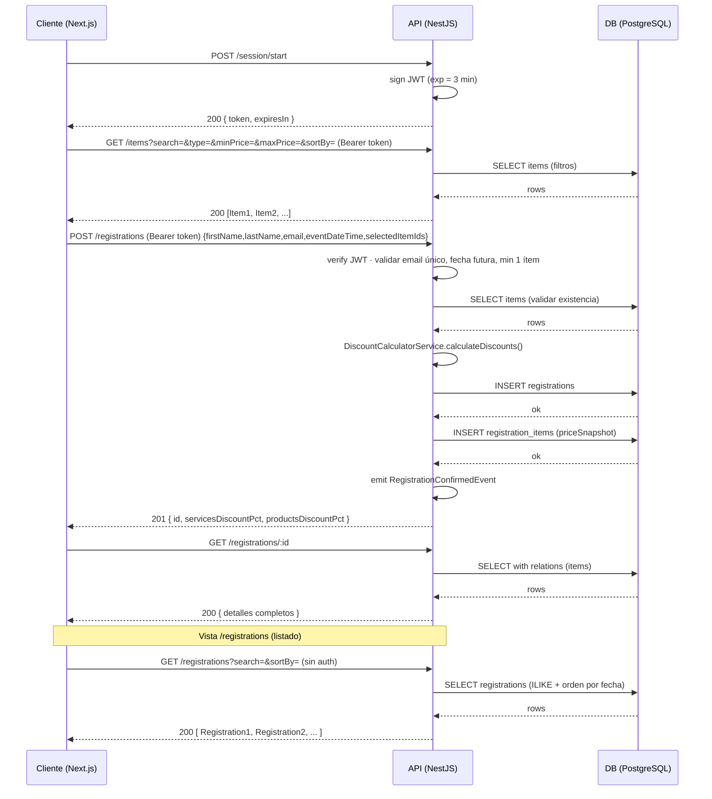
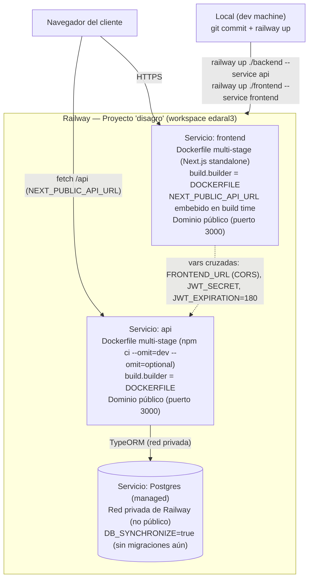

# Diagramas — Disagro (Mermaid)

5 diagramas en formato [Mermaid](https://mermaid.js.org/): texto plano, versionable en git y
renderizado nativo en GitHub, VS Code (con la extensión Markdown Preview Mermaid Support) y en
artifacts de Claude.

## 1. Arquitectura general

**Descuentos** (independientes): Servicios ≥2 → 3% · ≥2 y suma > Q.1,500 → 5% · Productos ≥3 → 3% · ≥5 → 5%.

## 2. CQRS por módulo (backend)

## 3. Modelo entidad-relación (PostgreSQL)

## 4. Secuencia de una confirmación

## 5. Deployment en Railway (✅ live)

